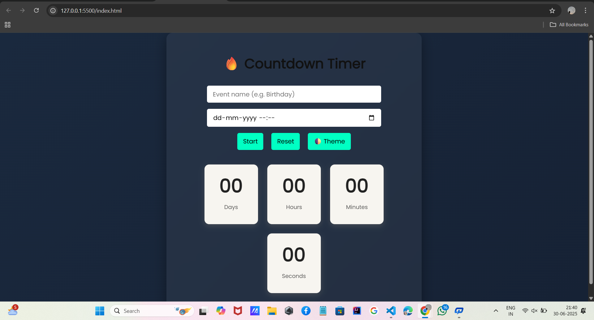

# ⏳ Countdown Timer ⌛ | Light/Dark Theme Toggle 🌙☀️

An elegant and responsive countdown timer built using **HTML, CSS, and JavaScript**, featuring a smooth **theme toggle**, stylish animations, and a clean, user-friendly UI.

---

## 📍 Overview

This project allows users to visualize a live countdown in real-time. With an interactive interface and sleek theme switcher, it’s a perfect blend of **functional logic** and **frontend polish**.

---

## ✨ Features

- ⏰ Live countdown timer that updates in real-time
- 🌓 Theme toggle (Light / Dark) with smooth CSS transitions
- 💡 Glassmorphism-inspired modern UI design
- 🔧 Modular, readable JavaScript code
- 🎯 Fully responsive for all screen sizes

---

## 🚀 Live Demo

[👉 View it live on GitHub Pages](https://saurabhbhattdev.github.io/countdown-timer)

---

## 📸 Preview

> *Note: Replace this image with your own UI screenshot for better presentation.*

---

## 🛠️ Built With

- **HTML5** – Markup structure
- **CSS3** – Styling, transitions, and layout
- **JavaScript** – Countdown logic + interactivity

---

## 📁 Folder Structure

